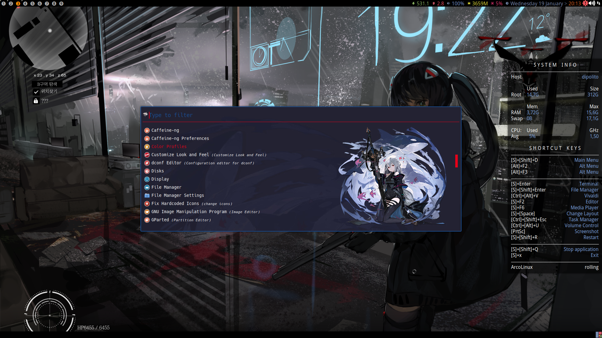

# Temas para o Rofi
 Repositório com arquivos de tema para o applauncher/faz tudo Rofi.

# Temas

  
bloodOcean

  

# Como usar
Para usar você pode clonar os arquivos e executar o rofi fazendo referência ao arquivo dos temas.
Eu defini o seguinte atalho no super + p:

    rofi -config ~/.config/rofi/bloodOcean/tema.rasi -show drun

É suposto que executar o run.sh do tema tenha o mesmo resultado.

